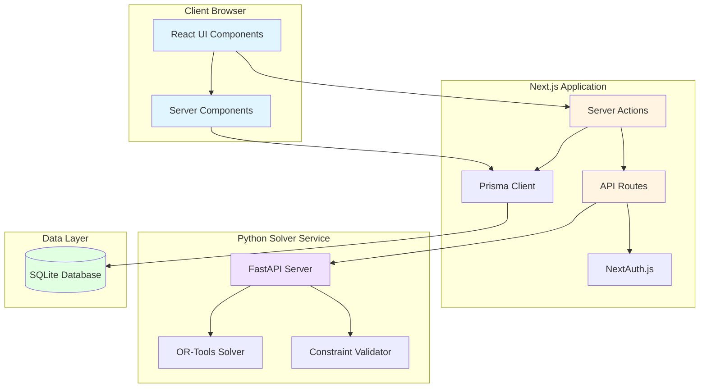
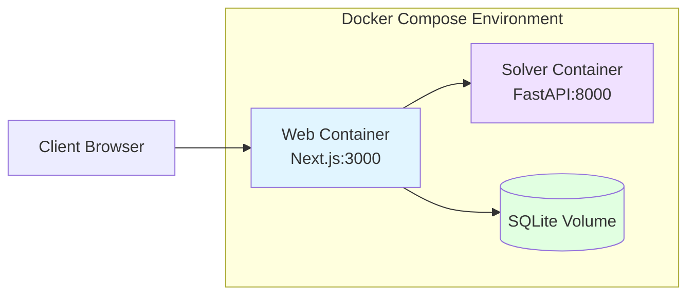

# Design Document

## Overview

The University Lecture Timetable Scheduler is a distributed system consisting of two main components: a Next.js 16 web application and a Python FastAPI optimization service. The web application handles user interactions, data management, and persistence using SQLite via Prisma ORM. The solver service performs constraint-based optimization using Google OR-Tools to generate optimal timetables. Communication between services occurs via REST API with API key authentication.

The system follows a modern full-stack architecture:
- **Frontend**: React Server Components with selective client components for interactivity
- **Backend**: Next.js Server Actions for mutations, direct Prisma calls for queries
- **Database**: SQLite with Prisma ORM (easily switchable to PostgreSQL)
- **Optimization**: Python FastAPI microservice with OR-Tools CP-SAT solver
- **UI**: Tailwind CSS + shadcn/ui component library
- **Auth**: NextAuth.js with JWT and role-based access control

## Architecture

### System Architecture Diagram




### Technology Stack

**Web Application (Next.js 16)**
- Framework: Next.js 16 with App Router
- Language: TypeScript 5.x
- UI Library: React 19
- Styling: Tailwind CSS 4.x
- Component Library: shadcn/ui (Radix UI primitives)
- Icons: lucide-react
- Charts: Recharts
- ORM: Prisma 6.x
- Database: SQLite (development), PostgreSQL-ready
- Authentication: NextAuth.js v5
- Validation: Zod
- State Management: React Query (TanStack Query) for client-side caching
- Forms: React Hook Form + Zod validation

**Solver Service (Python)**
- Framework: FastAPI 0.110+
- Language: Python 3.11+
- Optimization: Google OR-Tools (CP-SAT solver)
- Validation: Pydantic v2
- ASGI Server: Uvicorn
- API Documentation: Auto-generated OpenAPI/Swagger

**DevOps**
- Containerization: Docker + Docker Compose
- CI/CD: GitHub Actions
- Testing: Jest (unit), Playwright (e2e), pytest (Python)
- Linting: ESLint, Prettier, Ruff (Python)

### Deployment Architecture



## Components and Interfaces

### 1. Web Application Components

#### 1.1 Authentication Layer

**Purpose**: Handle user authentication and authorization

**Components**:
- `auth.config.ts`: NextAuth.js configuration with JWT strategy
- `middleware.ts`: Route protection and role-based access control
- `lib/auth.ts`: Auth helper functions and session management

**Key Features**:
- JWT-based authentication
- Three roles: ADMIN, FACULTY, STUDENT
- Protected routes with middleware
- Session management with secure cookies

**Interface**:
```typescript
interface User {
  id: string;
  email: string;
  name: string;
  role: 'ADMIN' | 'FACULTY' | 'STUDENT';
}

interface Session {
  user: User;
  expires: string;
}
```

#### 1.2 Data Management Module

**Purpose**: CRUD operations for academic entities

**Server Actions**:
- `actions/courses.ts`: Course management actions
- `actions/instructors.ts`: Instructor management actions
- `actions/rooms.ts`: Room management actions
- `actions/student-groups.ts`: Student group management actions

**Pages (Server Components)**:
- `app/admin/courses/page.tsx`: Course listing and management
- `app/admin/instructors/page.tsx`: Instructor management
- `app/admin/rooms/page.tsx`: Room management
- `app/admin/groups/page.tsx`: Student group management

**Client Components**:
- `components/data-table.tsx`: Reusable data table with sorting/filtering
- `components/entity-form.tsx`: Generic form for entity CRUD
- `components/import-dialog.tsx`: CSV/Excel import interface

**Key Features**:
- Server-side data fetching with React Server Components
- Optimistic updates with Server Actions
- CSV/Excel import/export using libraries like `papaparse` and `xlsx`
- Form validation with Zod schemas

#### 1.3 Constraint Configuration Module

**Purpose**: Define and manage scheduling constraints

**Components**:
- `app/admin/constraints/page.tsx`: Constraint configuration UI
- `components/constraint-editor.tsx`: Interactive constraint weight sliders
- `lib/constraints.ts`: Constraint validation and serialization

**Constraint Types**:
```typescript
interface HardConstraints {
  noRoomDoubleBooking: boolean;
  noInstructorDoubleBooking: boolean;
  roomCapacityCheck: boolean;
  roomTypeMatch: boolean;
  workingHoursOnly: boolean;
}

interface SoftConstraints {
  instructorPreferences: number; // weight 0-10
  compactSchedules: number;
  balancedDailyLoad: number;
  preferredRooms: number;
}

interface ConstraintConfig {
  hard: HardConstraints;
  soft: SoftConstraints;
}
```

#### 1.4 Timetable Generation Module

**Purpose**: Orchestrate timetable generation with solver service

**Server Actions**:
- `actions/generate-timetable.ts`: Main generation action
- `actions/validate-timetable.ts`: Validation action

**Components**:
- `app/admin/timetables/generate/page.tsx`: Generation interface
- `components/generation-progress.tsx`: Real-time progress display
- `components/conflict-report.tsx`: Conflict visualization

**Flow**:
1. User initiates generation from UI
2. Server Action collects data from Prisma
3. Formats payload for solver service
4. Calls solver API with retry logic
5. Receives optimized assignments
6. Stores results in database
7. Returns success/failure to client

**Solver API Client**:
```typescript
interface SolverClient {
  generateTimetable(payload: GenerationPayload): Promise<TimetableResult>;
  validateTimetable(timetable: Timetable): Promise<ValidationResult>;
  getStatus(jobId: string): Promise<JobStatus>;
}
```

#### 1.5 Timetable Viewing and Editing Module

**Purpose**: Display and manually edit timetables

**Pages**:
- `app/timetables/[id]/page.tsx`: Timetable detail view
- `app/timetables/[id]/edit/page.tsx`: Edit mode

**Client Components**:
- `components/calendar-view.tsx`: Weekly calendar grid (drag-and-drop)
- `components/assignment-card.tsx`: Individual assignment display
- `components/conflict-indicator.tsx`: Visual conflict warnings
- `components/filter-panel.tsx`: Filter by room/instructor/group

**Key Features**:
- Drag-and-drop using `@dnd-kit/core`
- Real-time conflict detection
- Optimistic UI updates
- Multiple view modes (week, day, list)

**Assignment Interface**:
```typescript
interface Assignment {
  id: number;
  day: string; // 'MONDAY' | 'TUESDAY' | ...
  startTime: string; // 'HH:MM'
  endTime: string; // 'HH:MM'
  courseId: number;
  instructorId: number;
  roomId: number;
  groupId: number;
  timetableId: number;
}
```

#### 1.6 Export Module

**Purpose**: Generate PDF and Excel exports

**Server Actions**:
- `actions/export-pdf.ts`: PDF generation using `react-pdf` or `puppeteer`
- `actions/export-excel.ts`: Excel generation using `xlsx`

**Features**:
- Filtered exports (by room, instructor, group)
- Formatted layouts with institutional branding
- Batch export for all groups

#### 1.7 Dashboard and Analytics Module

**Purpose**: Display system metrics and analytics

**Components**:
- `app/dashboard/page.tsx`: Main dashboard (role-specific)
- `components/stats-card.tsx`: Metric display cards
- `components/utilization-chart.tsx`: Room/instructor utilization charts
- `components/activity-feed.tsx`: Recent activity log

**Metrics Calculated**:
- Total entities count
- Room utilization percentage
- Instructor teaching load distribution
- Timetable fitness scores
- Constraint violation breakdown

### 2. Solver Service Components

#### 2.1 FastAPI Application Structure

```
solver/
├── app/
│   ├── main.py              # FastAPI app initialization
│   ├── api/
│   │   ├── routes.py        # API endpoints
│   │   └── dependencies.py  # Auth dependencies
│   ├── models/
│   │   ├── schemas.py       # Pydantic models
│   │   └── constraints.py   # Constraint definitions
│   ├── solver/
│   │   ├── optimizer.py     # OR-Tools solver logic
│   │   ├── validator.py     # Constraint validation
│   │   └── heuristics.py    # Fallback heuristics
│   └── config.py            # Configuration
├── tests/
├── requirements.txt
└── Dockerfile
```

#### 2.2 API Endpoints

**POST /api/v1/generate**
- Input: GenerationPayload (courses, rooms, instructors, groups, constraints)
- Output: TimetableResult (assignments, fitness_score, violations)
- Process: Run CP-SAT solver with constraints

**POST /api/v1/validate**
- Input: Timetable data
- Output: ValidationResult (is_valid, conflicts)
- Process: Check all hard constraints

**GET /api/v1/health**
- Output: Service health status

**GET /docs**
- Auto-generated OpenAPI documentation

#### 2.3 Optimization Engine

**Purpose**: Solve timetable scheduling problem using constraint programming

**Algorithm**:
1. Parse input JSON into internal model
2. Create CP-SAT model with decision variables
3. Add hard constraints (must be satisfied)
4. Add soft constraints with penalty costs
5. Set objective: minimize total penalty
6. Run solver with time limit (configurable)
7. Extract solution and format response

**Decision Variables**:
```python
# For each (course, timeslot, room, instructor, group) combination
x[c, t, r, i, g] = 1 if course c is assigned to timeslot t, room r, instructor i, group g
                 = 0 otherwise
```

**Hard Constraints**:
- Each course assigned exactly once
- No room conflicts (one course per room per timeslot)
- No instructor conflicts (one course per instructor per timeslot)
- No group conflicts (one course per group per timeslot)
- Room capacity >= group size
- Room type matches course requirements
- Instructor availability respected

**Soft Constraints** (with penalties):
- Instructor preference violations: penalty * weight
- Non-compact schedules: gap_count * weight
- Unbalanced daily load: variance * weight
- Non-preferred room: penalty * weight

**Solver Configuration**:
```python
solver = cp_model.CpSolver()
solver.parameters.max_time_in_seconds = 300  # 5 minutes
solver.parameters.num_search_workers = 8
solver.parameters.log_search_progress = True
```

## Data Models

### Prisma Schema


```prisma
datasource db {
  provider = "sqlite"
  url      = env("DATABASE_URL")
}

generator client {
  provider = "prisma-client-js"
}

model User {
  id        String   @id @default(cuid())
  email     String   @unique
  name      String
  password  String
  role      Role     @default(STUDENT)
  createdAt DateTime @default(now())
  updatedAt DateTime @updatedAt
  
  instructor Instructor?
  studentGroup StudentGroup?
}

enum Role {
  ADMIN
  FACULTY
  STUDENT
}

model Course {
  id          Int      @id @default(autoincrement())
  code        String   @unique
  title       String
  duration    Int      // in minutes
  credits     Int
  department  String
  roomType    String?  // required room type (e.g., 'LAB', 'LECTURE_HALL')
  createdAt   DateTime @default(now())
  updatedAt   DateTime @updatedAt
  
  instructors CourseInstructor[]
  groups      CourseGroup[]
  assignments Assignment[]
}

model Instructor {
  id           Int      @id @default(autoincrement())
  userId       String?  @unique
  name         String
  email        String   @unique
  department   String
  teachingLoad Int      // max hours per week
  availability Json     // { "MONDAY": ["09:00-12:00", "14:00-17:00"], ... }
  preferences  Json?    // { "preferredDays": ["MONDAY", "WEDNESDAY"], "preferredTimes": [...] }
  createdAt    DateTime @default(now())
  updatedAt    DateTime @updatedAt
  
  user         User?    @relation(fields: [userId], references: [id])
  courses      CourseInstructor[]
  assignments  Assignment[]
}

model Room {
  id        Int      @id @default(autoincrement())
  name      String   @unique
  building  String
  capacity  Int
  type      String   // 'LECTURE_HALL', 'LAB', 'SEMINAR', 'AUDITORIUM'
  equipment Json?    // ['PROJECTOR', 'WHITEBOARD', 'COMPUTERS']
  createdAt DateTime @default(now())
  updatedAt DateTime @updatedAt
  
  assignments Assignment[]
}

model StudentGroup {
  id        Int      @id @default(autoincrement())
  name      String   @unique
  program   String
  year      Int
  semester  Int
  size      Int
  createdAt DateTime @default(now())
  updatedAt DateTime @updatedAt
  
  courses     CourseGroup[]
  assignments Assignment[]
}

model CourseInstructor {
  courseId     Int
  instructorId Int
  isPrimary    Boolean @default(true)
  
  course     Course     @relation(fields: [courseId], references: [id], onDelete: Cascade)
  instructor Instructor @relation(fields: [instructorId], references: [id], onDelete: Cascade)
  
  @@id([courseId, instructorId])
}

model CourseGroup {
  courseId Int
  groupId  Int
  
  course Course       @relation(fields: [courseId], references: [id], onDelete: Cascade)
  group  StudentGroup @relation(fields: [groupId], references: [id], onDelete: Cascade)
  
  @@id([courseId, groupId])
}

model Timetable {
  id          Int      @id @default(autoincrement())
  name        String
  semester    String   // e.g., 'Fall 2025', 'Spring 2025'
  academicYear String
  status      TimetableStatus @default(DRAFT)
  fitnessScore Float?
  violations  Json?    // soft constraint violation details
  createdAt   DateTime @default(now())
  updatedAt   DateTime @updatedAt
  publishedAt DateTime?
  
  assignments Assignment[]
}

enum TimetableStatus {
  DRAFT
  GENERATING
  GENERATED
  PUBLISHED
  ARCHIVED
}

model Assignment {
  id           Int      @id @default(autoincrement())
  day          Day
  startTime    String   // 'HH:MM' format
  endTime      String   // 'HH:MM' format
  
  courseId     Int
  instructorId Int
  roomId       Int
  groupId      Int
  timetableId  Int
  
  course     Course       @relation(fields: [courseId], references: [id], onDelete: Cascade)
  instructor Instructor   @relation(fields: [instructorId], references: [id], onDelete: Cascade)
  room       Room         @relation(fields: [roomId], references: [id], onDelete: Cascade)
  group      StudentGroup @relation(fields: [groupId], references: [id], onDelete: Cascade)
  timetable  Timetable    @relation(fields: [timetableId], references: [id], onDelete: Cascade)
  
  createdAt DateTime @default(now())
  updatedAt DateTime @updatedAt
  
  @@unique([timetableId, day, startTime, roomId])
  @@unique([timetableId, day, startTime, instructorId])
  @@unique([timetableId, day, startTime, groupId])
}

enum Day {
  MONDAY
  TUESDAY
  WEDNESDAY
  THURSDAY
  FRIDAY
  SATURDAY
  SUNDAY
}

model ConstraintConfig {
  id        Int      @id @default(autoincrement())
  name      String   @unique
  isDefault Boolean  @default(false)
  
  // Hard constraints (boolean flags)
  noRoomDoubleBooking       Boolean @default(true)
  noInstructorDoubleBooking Boolean @default(true)
  roomCapacityCheck         Boolean @default(true)
  roomTypeMatch             Boolean @default(true)
  workingHoursOnly          Boolean @default(true)
  
  // Soft constraint weights (0-10)
  instructorPreferencesWeight Int @default(5)
  compactSchedulesWeight      Int @default(7)
  balancedDailyLoadWeight     Int @default(6)
  preferredRoomsWeight        Int @default(3)
  
  // Working hours
  workingHoursStart String @default("08:00")
  workingHoursEnd   String @default("18:00")
  
  createdAt DateTime @default(now())
  updatedAt DateTime @updatedAt
}
```

### Python Pydantic Models

```python
from pydantic import BaseModel, Field
from typing import List, Dict, Optional
from enum import Enum

class Day(str, Enum):
    MONDAY = "MONDAY"
    TUESDAY = "TUESDAY"
    WEDNESDAY = "WEDNESDAY"
    THURSDAY = "THURSDAY"
    FRIDAY = "FRIDAY"
    SATURDAY = "SATURDAY"
    SUNDAY = "SUNDAY"

class CourseInput(BaseModel):
    id: int
    code: str
    title: str
    duration: int
    department: str
    room_type: Optional[str] = None
    instructor_ids: List[int]
    group_ids: List[int]

class InstructorInput(BaseModel):
    id: int
    name: str
    department: str
    teaching_load: int
    availability: Dict[Day, List[str]]  # {"MONDAY": ["09:00-12:00"]}
    preferences: Optional[Dict] = None

class RoomInput(BaseModel):
    id: int
    name: str
    capacity: int
    type: str
    equipment: Optional[List[str]] = None

class StudentGroupInput(BaseModel):
    id: int
    name: str
    size: int
    course_ids: List[int]

class ConstraintConfigInput(BaseModel):
    hard: Dict[str, bool]
    soft: Dict[str, int]  # weights 0-10
    working_hours_start: str = "08:00"
    working_hours_end: str = "18:00"

class GenerationPayload(BaseModel):
    courses: List[CourseInput]
    instructors: List[InstructorInput]
    rooms: List[RoomInput]
    groups: List[StudentGroupInput]
    constraints: ConstraintConfigInput
    time_limit_seconds: int = Field(default=300, ge=10, le=600)

class AssignmentOutput(BaseModel):
    course_id: int
    instructor_id: int
    room_id: int
    group_id: int
    day: Day
    start_time: str
    end_time: str

class ViolationDetail(BaseModel):
    constraint_type: str
    severity: str  # 'hard' or 'soft'
    description: str
    affected_assignments: List[int]

class TimetableResult(BaseModel):
    success: bool
    assignments: List[AssignmentOutput]
    fitness_score: Optional[float] = None
    violations: List[ViolationDetail] = []
    solve_time_seconds: float
    message: str

class ValidationResult(BaseModel):
    is_valid: bool
    conflicts: List[ViolationDetail]
```

## Error Handling

### Web Application Error Handling

**Server Actions**:
- Wrap all actions in try-catch blocks
- Return typed result objects: `{ success: boolean, data?: T, error?: string }`
- Log errors to console/monitoring service
- Display user-friendly error messages

**Example**:
```typescript
export async function createCourse(data: CourseInput): Promise<ActionResult<Course>> {
  try {
    const validated = courseSchema.parse(data);
    const course = await prisma.course.create({ data: validated });
    revalidatePath('/admin/courses');
    return { success: true, data: course };
  } catch (error) {
    if (error instanceof z.ZodError) {
      return { success: false, error: 'Invalid input data' };
    }
    console.error('Failed to create course:', error);
    return { success: false, error: 'Failed to create course' };
  }
}
```

**API Routes**:
- Use Next.js error boundaries
- Return appropriate HTTP status codes
- Include error details in development, generic messages in production

**Solver Communication**:
- Implement retry logic with exponential backoff
- Handle timeout errors gracefully
- Provide fallback messages when solver is unavailable

### Solver Service Error Handling

**FastAPI Exception Handlers**:
```python
from fastapi import HTTPException, status

@app.exception_handler(ValueError)
async def value_error_handler(request, exc):
    return JSONResponse(
        status_code=status.HTTP_400_BAD_REQUEST,
        content={"detail": str(exc)}
    )

@app.exception_handler(Exception)
async def general_exception_handler(request, exc):
    logger.error(f"Unexpected error: {exc}")
    return JSONResponse(
        status_code=status.HTTP_500_INTERNAL_SERVER_ERROR,
        content={"detail": "Internal server error"}
    )
```

**Solver Failures**:
- Return infeasibility details when no solution found
- Suggest constraint relaxation strategies
- Log solver statistics for debugging

## Testing Strategy

### Web Application Testing

**Unit Tests (Jest)**:
- Test utility functions
- Test Zod schemas
- Test data transformation logic
- Target: 80% coverage for utilities

**Integration Tests (Jest + Prisma)**:
- Test Server Actions with test database
- Test Prisma queries
- Mock external API calls (solver service)

**E2E Tests (Playwright)**:
- Test critical user flows:
  - Admin login and course creation
  - Timetable generation flow
  - Manual editing and validation
  - Export functionality
- Test role-based access control
- Test responsive design

**Example E2E Test**:
```typescript
test('admin can generate timetable', async ({ page }) => {
  await page.goto('/login');
  await page.fill('[name="email"]', 'admin@test.com');
  await page.fill('[name="password"]', 'password');
  await page.click('button[type="submit"]');
  
  await page.goto('/admin/timetables/generate');
  await page.click('button:has-text("Generate")');
  
  await expect(page.locator('text=Generating timetable')).toBeVisible();
  await expect(page.locator('text=Generation complete')).toBeVisible({ timeout: 60000 });
});
```

### Solver Service Testing

**Unit Tests (pytest)**:
- Test constraint validation logic
- Test data parsing and transformation
- Test individual constraint functions

**Integration Tests (pytest + FastAPI TestClient)**:
- Test API endpoints with sample data
- Test solver with small problem instances
- Verify response formats

**Performance Tests**:
- Benchmark solver with 2000+ events
- Measure solve time vs problem size
- Test timeout handling

**Example Test**:
```python
def test_generate_timetable_success():
    client = TestClient(app)
    payload = create_sample_payload()
    
    response = client.post("/api/v1/generate", json=payload)
    
    assert response.status_code == 200
    result = response.json()
    assert result["success"] is True
    assert len(result["assignments"]) > 0
    assert result["fitness_score"] is not None
```

## Security Considerations

**Authentication**:
- Secure password hashing with bcrypt
- JWT tokens with short expiration (1 hour)
- Refresh token rotation
- CSRF protection enabled

**Authorization**:
- Role-based middleware on all protected routes
- Server-side permission checks in Server Actions
- API key authentication for solver service

**Data Validation**:
- Zod schemas for all user inputs
- Pydantic models for solver API
- SQL injection prevention via Prisma parameterized queries

**API Security**:
- Rate limiting on solver endpoints
- API key stored in environment variables
- CORS configuration for production

**Environment Variables**:
```env
# Web App
DATABASE_URL="file:./dev.db"
NEXTAUTH_SECRET="<random-secret>"
NEXTAUTH_URL="http://localhost:3000"
SOLVER_API_URL="http://solver:8000"
SOLVER_API_KEY="<random-api-key>"

# Solver Service
API_KEY="<same-random-api-key>"
LOG_LEVEL="INFO"
```

## Performance Optimization

**Web Application**:
- Use React Server Components for initial page loads
- Implement pagination for large data tables
- Use React Query for client-side caching
- Optimize Prisma queries with `include` and `select`
- Implement database indexes on foreign keys

**Database Indexes**:
```prisma
model Assignment {
  // ... fields ...
  
  @@index([timetableId])
  @@index([courseId])
  @@index([instructorId])
  @@index([roomId])
  @@index([groupId])
  @@index([day, startTime])
}
```

**Solver Service**:
- Use multi-threaded CP-SAT solver
- Implement caching for repeated problem instances
- Set reasonable time limits (5 minutes default)
- Consider heuristic fallback for very large problems

**Monitoring**:
- Log solver performance metrics
- Track API response times
- Monitor database query performance
- Set up alerts for failures

## Deployment Configuration

### Docker Compose Setup

```yaml
version: '3.9'

services:
  web:
    build:
      context: ./web
      dockerfile: Dockerfile
    ports:
      - "3000:3000"
    environment:
      - DATABASE_URL=file:/app/data/dev.db
      - SOLVER_API_URL=http://solver:8000
      - SOLVER_API_KEY=${SOLVER_API_KEY}
      - NEXTAUTH_SECRET=${NEXTAUTH_SECRET}
      - NEXTAUTH_URL=http://localhost:3000
    volumes:
      - sqlite-data:/app/data
    depends_on:
      - solver
    restart: unless-stopped

  solver:
    build:
      context: ./solver
      dockerfile: Dockerfile
    ports:
      - "8000:8000"
    environment:
      - API_KEY=${SOLVER_API_KEY}
      - LOG_LEVEL=INFO
    restart: unless-stopped

volumes:
  sqlite-data:
```

### Web Dockerfile

```dockerfile
FROM node:18-alpine AS base

# Dependencies
FROM base AS deps
WORKDIR /app
RUN corepack enable && corepack prepare pnpm@latest --activate
COPY package.json pnpm-lock.yaml ./
RUN pnpm install --frozen-lockfile

# Builder
FROM base AS builder
WORKDIR /app
COPY --from=deps /app/node_modules ./node_modules
COPY . .
RUN corepack enable && corepack prepare pnpm@latest --activate
RUN pnpm prisma generate
RUN pnpm run build

# Runner
FROM base AS runner
WORKDIR /app
ENV NODE_ENV=production

COPY --from=builder /app/public ./public
COPY --from=builder /app/.next/standalone ./
COPY --from=builder /app/.next/static ./.next/static
COPY --from=builder /app/prisma ./prisma
COPY --from=builder /app/node_modules/.prisma ./node_modules/.prisma

EXPOSE 3000
CMD ["node", "server.js"]
```

### Solver Dockerfile

```dockerfile
FROM python:3.11-slim

WORKDIR /app

# Install dependencies
COPY requirements.txt .
RUN pip install --no-cache-dir -r requirements.txt

# Copy application
COPY ./app ./app

EXPOSE 8000

CMD ["uvicorn", "app.main:app", "--host", "0.0.0.0", "--port", "8000"]
```

## Migration Path

**Phase 1: Development Setup**
- Initialize Next.js project with App Router
- Set up Prisma with SQLite
- Implement authentication
- Create basic CRUD operations

**Phase 2: Core Features**
- Implement data management UI
- Build constraint configuration
- Develop solver service
- Integrate solver with web app

**Phase 3: Advanced Features**
- Add manual editing with drag-and-drop
- Implement export functionality
- Build analytics dashboard
- Add faculty availability management

**Phase 4: Production Readiness**
- Switch to PostgreSQL (optional)
- Implement comprehensive testing
- Set up CI/CD pipeline
- Deploy with Docker Compose
- Performance optimization

**Database Migration (SQLite → PostgreSQL)**:
1. Update Prisma schema datasource
2. Run `prisma migrate dev` to generate migrations
3. Export data from SQLite
4. Import data to PostgreSQL
5. Update DATABASE_URL environment variable
6. Restart application
