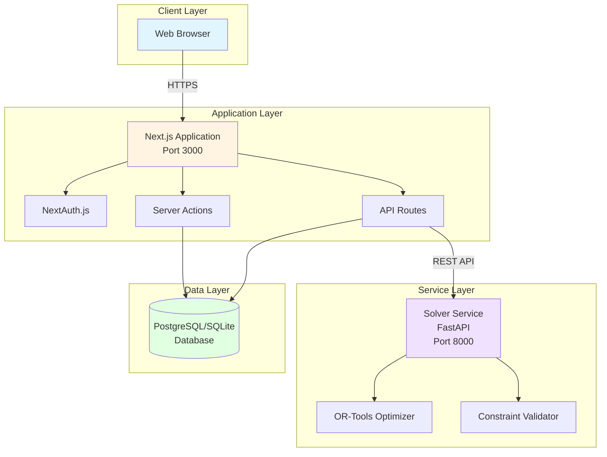
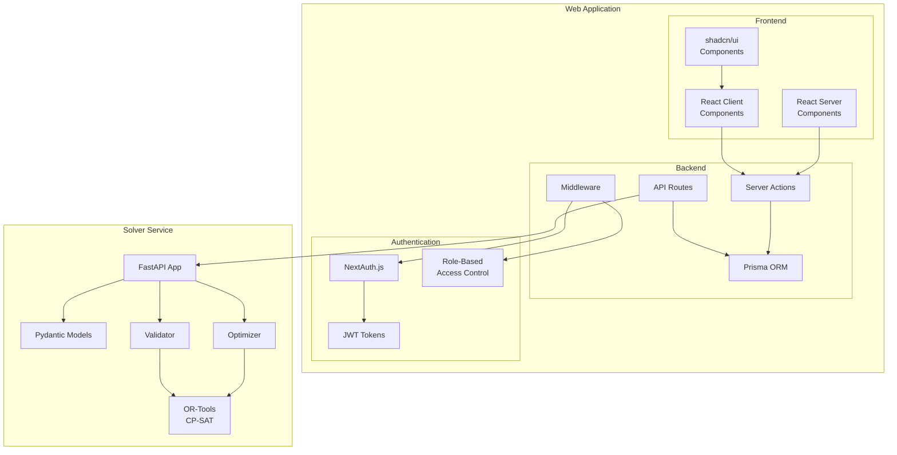
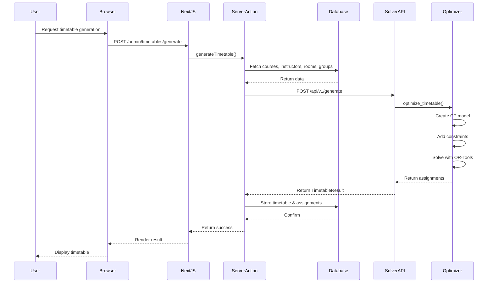
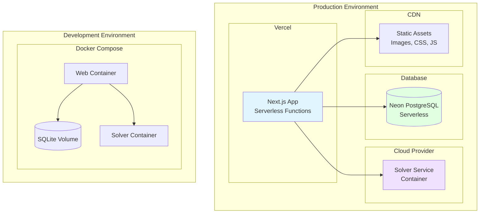
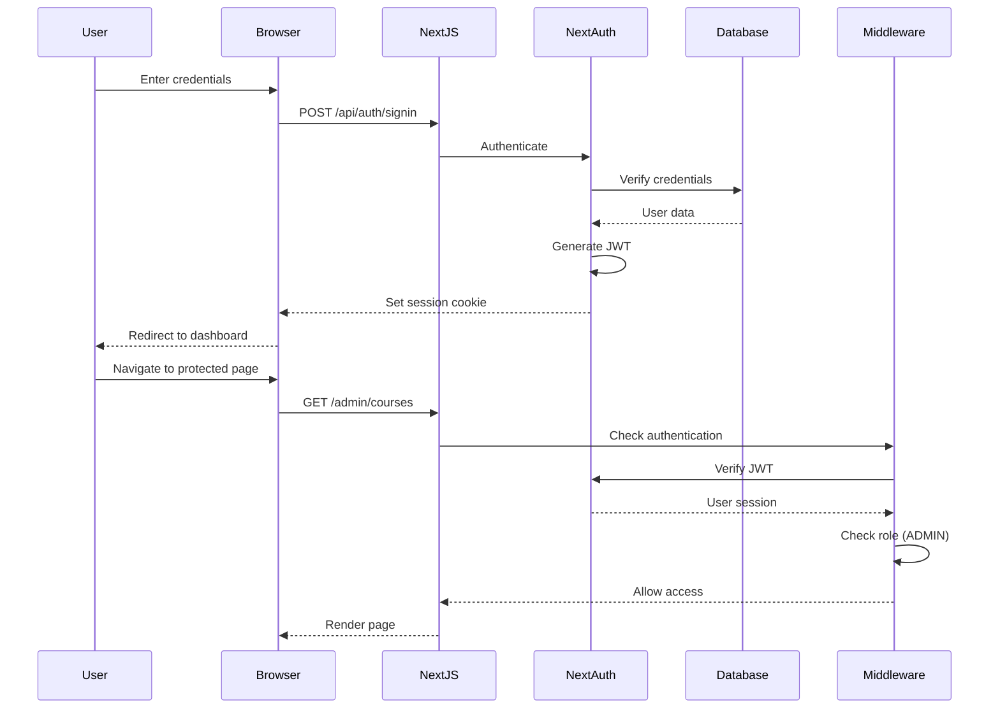

# Architecture Documentation

## Table of Contents

1. [System Overview](#system-overview)
2. [Architecture Diagrams](#architecture-diagrams)
3. [Component Details](#component-details)
4. [Data Flow](#data-flow)
5. [Technology Stack](#technology-stack)
6. [Deployment Architecture](#deployment-architecture)
7. [Security Architecture](#security-architecture)
8. [Scalability Considerations](#scalability-considerations)

---

## System Overview

The University Timetable Scheduler is a full-stack application with two solver implementations:

1. **Web Application** - Next.js 16 full-stack application with integrated local solver
2. **Solver Service** (Optional) - Python FastAPI microservice with OR-Tools

The system uses a **hybrid architecture**:
- Web app handles user interactions, data persistence, business logic, and timetable optimization (via local solver)
- Optional solver service provides alternative optimization using OR-Tools CP-SAT for cases requiring proven optimal solutions

**Default Behavior**: The local TypeScript solver runs directly in the web application, providing fast results without external dependencies.

### Key Characteristics

- **Distributed:** Services can be deployed independently
- **Scalable:** Solver service can be scaled horizontally
- **Resilient:** Failure in one service doesn't crash the entire system
- **Maintainable:** Clear boundaries between components
- **Testable:** Services can be tested independently

---

## Architecture Diagrams

### High-Level System Architecture



### Component Architecture



### Data Flow Architecture



### Deployment Architecture



### Authentication Flow



---

## Component Details

### Web Application Components

#### 1. Frontend Layer

**React Server Components (RSC)**
- Purpose: Server-side rendering for initial page loads
- Benefits: Better performance, SEO, reduced JavaScript bundle
- Examples: Dashboard pages, data tables, timetable views

**React Client Components (RCC)**
- Purpose: Interactive UI elements requiring client-side state
- Benefits: Rich interactivity, real-time updates
- Examples: Forms, drag-and-drop, modals, filters

**shadcn/ui Components**
- Purpose: Reusable UI primitives
- Based on: Radix UI (accessible, unstyled)
- Styled with: Tailwind CSS
- Examples: Button, Dialog, Select, Table

#### 2. Backend Layer

**Server Actions**
- Purpose: Server-side mutations called from React components
- Benefits: Type-safe, no API routes needed, automatic revalidation
- Examples:
  ```typescript
  export async function createCourse(data: CourseInput): Promise<ActionResult> {
    // Validate input
    // Save to database
    // Revalidate cache
    // Return result
  }
  ```

**API Routes**
- Purpose: REST endpoints for external services
- Use cases: Solver communication, webhooks, third-party integrations
- Examples: `/api/auth/*`, `/api/solver/generate`

**Middleware**
- Purpose: Request interception for authentication and authorization
- Runs on: Every request before route handler
- Responsibilities:
  - Verify JWT tokens
  - Check user roles
  - Redirect unauthorized users
  - Log requests

**Prisma ORM**
- Purpose: Type-safe database access
- Features:
  - Schema definition
  - Migrations
  - Query builder
  - Type generation
- Example:
  ```typescript
  const courses = await prisma.course.findMany({
    include: {
      instructors: true,
      groups: true
    }
  });
  ```

#### 3. Authentication Layer

**NextAuth.js**
- Purpose: Authentication framework for Next.js
- Strategy: JWT (JSON Web Tokens)
- Providers: Credentials (email/password)
- Session management: Secure HTTP-only cookies

**Role-Based Access Control (RBAC)**
- Roles: ADMIN, FACULTY, STUDENT
- Implementation: Middleware checks user role against route requirements
- Example:
  ```typescript
  if (user.role !== 'ADMIN' && pathname.startsWith('/admin')) {
    return NextResponse.redirect('/unauthorized');
  }
  ```

### Solver Service Components

#### 1. FastAPI Application

**Main Application**
- Purpose: HTTP server for optimization requests
- Features:
  - Automatic OpenAPI documentation
  - Request validation with Pydantic
  - Async request handling
  - CORS middleware

**API Key Authentication**
- Purpose: Secure service-to-service communication
- Implementation: Header-based (`X-API-Key`)
- Validation: Dependency injection

#### 2. Pydantic Models

**Purpose:** Request/response validation and serialization

**Models:**
- `GenerationPayload`: Input for timetable generation
- `TimetableResult`: Output with assignments and fitness score
- `ValidationPayload`: Input for constraint validation
- `ValidationResult`: Output with conflicts
- `CourseInput`, `InstructorInput`, `RoomInput`, `StudentGroupInput`

**Benefits:**
- Automatic validation
- Type hints
- JSON serialization
- OpenAPI schema generation

#### 3. Optimizer

**Purpose:** Generate optimized timetables using constraint programming

**Key Classes:**
- `TimetableOptimizer`: Main optimizer class
- `cp_model.CpModel`: OR-Tools constraint model
- `cp_model.CpSolver`: Solver instance

**Process:**
1. Parse input data
2. Create decision variables
3. Add hard constraints
4. Add soft constraints with penalties
5. Set objective function
6. Solve model
7. Extract solution

#### 4. Validator

**Purpose:** Validate existing timetables for conflicts

**Checks:**
- Room conflicts
- Instructor conflicts
- Student group conflicts
- Room capacity
- Room type matching
- Instructor availability
- Working hours

**Output:** List of violations with descriptions

---

## Data Flow

### Timetable Generation Flow

```
1. User initiates generation
   ↓
2. Server Action collects data from database
   ↓
3. Format payload for solver
   ↓
4. HTTP POST to solver service
   ↓
5. Solver creates CP model
   ↓
6. Solver adds constraints
   ↓
7. OR-Tools solves model
   ↓
8. Extract assignments from solution
   ↓
9. Calculate fitness score
   ↓
10. Identify violations
   ↓
11. Return result to web app
   ↓
12. Store timetable in database
   ↓
13. Revalidate cache
   ↓
14. Display result to user
```

### Manual Edit Flow

```
1. User drags assignment to new slot
   ↓
2. Client-side validation (basic checks)
   ↓
3. Server Action receives update request
   ↓
4. Validate against hard constraints
   ↓
5. If valid: Update database
   ↓
6. Revalidate timetable page
   ↓
7. Return success/error to client
   ↓
8. Update UI optimistically
```

### Authentication Flow

```
1. User submits login form
   ↓
2. NextAuth.js receives credentials
   ↓
3. Query database for user
   ↓
4. Verify password (bcrypt)
   ↓
5. Generate JWT with user data
   ↓
6. Set secure HTTP-only cookie
   ↓
7. Redirect to dashboard
   ↓
8. Middleware verifies JWT on each request
   ↓
9. Check role for authorization
   ↓
10. Allow/deny access
```

---

## Technology Stack

### Web Application

| Layer | Technology | Purpose |
|-------|-----------|---------|
| Framework | Next.js 16 | Full-stack React framework |
| Language | TypeScript 5 | Type-safe JavaScript |
| UI Library | React 19 | Component-based UI |
| Styling | Tailwind CSS 4 | Utility-first CSS |
| Components | shadcn/ui | Accessible UI primitives |
| Icons | Lucide React | Icon library |
| Charts | Recharts | Data visualization |
| ORM | Prisma 6 | Database toolkit |
| Database | PostgreSQL/SQLite | Relational database |
| Auth | NextAuth.js v5 | Authentication |
| Validation | Zod | Schema validation |
| Forms | React Hook Form | Form management |
| State | TanStack Query | Server state management |
| Drag & Drop | @dnd-kit | Drag and drop |

### Solver Service

| Layer | Technology | Purpose |
|-------|-----------|---------|
| Framework | FastAPI 0.110+ | Modern Python web framework |
| Language | Python 3.11+ | Programming language |
| Optimization | Google OR-Tools | Constraint programming |
| Validation | Pydantic v2 | Data validation |
| Server | Uvicorn | ASGI server |
| Testing | pytest | Testing framework |

### DevOps

| Tool | Purpose |
|------|---------|
| Docker | Containerization |
| Docker Compose | Multi-container orchestration |
| GitHub Actions | CI/CD pipeline |
| Vercel | Web app hosting |
| Railway/Render | Solver service hosting |
| Neon | PostgreSQL hosting |

---

## Deployment Architecture

### Development Environment

**Docker Compose Setup:**

```yaml
services:
  web:
    build: ./
    ports: ["3000:3000"]
    environment:
      - DATABASE_URL=file:/app/data/dev.db
      - SOLVER_API_URL=http://solver:8000
    volumes:
      - sqlite-data:/app/data
    depends_on:
      - solver
  
  solver:
    build: ./solver
    ports: ["8000:8000"]
    environment:
      - API_KEY=${SOLVER_API_KEY}
```

**Benefits:**
- Consistent environment across team
- Easy setup (one command)
- Isolated services
- Volume persistence

### Production Environment

**Web Application (Vercel):**
- Serverless deployment
- Automatic scaling
- Edge network (CDN)
- Zero-config deployment
- Environment variables management

**Solver Service (Railway/Render):**
- Container deployment
- Automatic scaling
- Health checks
- Log aggregation
- Metrics monitoring

**Database (Neon):**
- Serverless PostgreSQL
- Automatic backups
- Connection pooling
- Branching for development
- High availability

**Architecture Benefits:**
- Scalability: Each service scales independently
- Reliability: Managed services with SLAs
- Performance: CDN for static assets, edge functions
- Cost-effective: Pay for what you use

---

## Security Architecture

### Authentication Security

**Password Security:**
- Hashing: bcrypt with salt
- Minimum strength requirements
- No plain text storage

**JWT Security:**
- Signed tokens (HS256)
- Short expiration (1 hour)
- Secure HTTP-only cookies
- CSRF protection

**Session Management:**
- Automatic token refresh
- Logout invalidates session
- Concurrent session limits

### Authorization Security

**Role-Based Access Control:**
- Middleware enforcement
- Server-side validation
- Principle of least privilege

**API Security:**
- API key authentication for solver
- Rate limiting (production)
- CORS configuration
- Input validation

### Data Security

**Database Security:**
- Parameterized queries (SQL injection prevention)
- Connection encryption (SSL/TLS)
- Backup encryption
- Access control

**Transport Security:**
- HTTPS only in production
- TLS 1.3
- HSTS headers
- Secure cookies

### Application Security

**Input Validation:**
- Zod schemas for all inputs
- Pydantic models for API
- XSS prevention (React escaping)
- CSRF tokens

**Error Handling:**
- Generic error messages (production)
- Detailed logs (server-side)
- No sensitive data in responses

---

## Scalability Considerations

### Horizontal Scaling

**Web Application:**
- Stateless design (no server-side sessions)
- Can deploy multiple instances
- Load balancer distributes traffic
- Shared database

**Solver Service:**
- Stateless optimization
- Can deploy multiple instances
- Queue-based job distribution
- Independent scaling

### Vertical Scaling

**Solver Service:**
- CPU-intensive workload
- Benefits from more cores
- Configurable worker threads
- Memory requirements scale with problem size

### Database Scaling

**Read Replicas:**
- Separate read and write operations
- Read-heavy workload optimization
- Eventual consistency acceptable

**Connection Pooling:**
- Prisma connection pooling
- Neon serverless pooling
- Reduces connection overhead

### Caching Strategy

**Next.js Caching:**
- React Server Components cache
- Static page generation
- Incremental Static Regeneration
- API route caching

**Database Caching:**
- Query result caching
- Redis for session storage (optional)
- CDN for static assets

### Performance Optimization

**Web Application:**
- Code splitting
- Lazy loading
- Image optimization
- Bundle size optimization

**Solver Service:**
- Parallel search workers
- Problem size limits
- Timeout configuration
- Result caching (future)

### Monitoring and Observability

**Metrics:**
- Request latency
- Error rates
- Solver performance
- Database query time

**Logging:**
- Structured logging
- Log aggregation
- Error tracking
- Audit trails

**Alerting:**
- High error rates
- Slow response times
- Service downtime
- Resource exhaustion

---

## Design Patterns

### Web Application Patterns

**Server Actions Pattern:**
- Encapsulate mutations
- Type-safe client-server communication
- Automatic revalidation

**Repository Pattern:**
- Abstract database access
- Centralized query logic
- Easier testing

**Dependency Injection:**
- Prisma client injection
- Auth context injection
- Testable components

### Solver Service Patterns

**Strategy Pattern:**
- Different constraint strategies
- Pluggable optimization algorithms
- Configurable behavior

**Factory Pattern:**
- Model creation
- Variable generation
- Constraint instantiation

**Template Method:**
- Optimization workflow
- Validation workflow
- Consistent process

---

## Future Architecture Considerations

### Potential Enhancements

**Message Queue:**
- Async timetable generation
- Job status tracking
- Retry mechanism
- Priority queuing

**Caching Layer:**
- Redis for session storage
- Result caching
- Rate limiting
- Real-time updates

**Microservices Expansion:**
- Notification service
- Reporting service
- Analytics service
- Import/export service

**Event-Driven Architecture:**
- Event bus (e.g., RabbitMQ, Kafka)
- Publish/subscribe pattern
- Decoupled services
- Audit logging

### Scalability Roadmap

**Phase 1: Current (Single Instance)**
- Monolithic web app
- Single solver instance
- SQLite/PostgreSQL

**Phase 2: Horizontal Scaling**
- Multiple web instances
- Multiple solver instances
- Load balancer
- PostgreSQL with replicas

**Phase 3: Distributed System**
- Message queue
- Caching layer
- Microservices
- Event-driven

**Phase 4: Cloud-Native**
- Kubernetes orchestration
- Auto-scaling
- Service mesh
- Observability platform

---

## Conclusion

The University Timetable Scheduler architecture is designed for:
- **Maintainability:** Clear separation of concerns
- **Scalability:** Independent service scaling
- **Reliability:** Fault isolation and recovery
- **Security:** Defense in depth
- **Performance:** Optimized for common use cases

The architecture supports the current requirements while providing a foundation for future growth and enhancement.

---

**Version:** 1.0.0  
**Last Updated:** November 26, 2025  
**Maintained By:** Development Team
